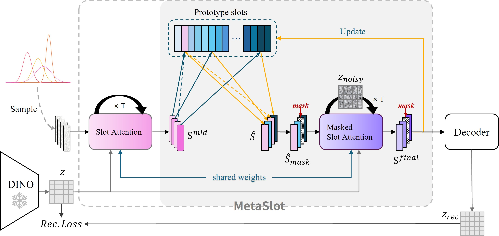

# MetaSlot: Break Through the Fixed Number of Slots in Object-Centric Learning

This repository contains the official implementation of **MetaSlot**, a novel aggregation module designed to improve object-centric learning (OCL). MetaSlot addresses two long-standing limitations in conventional Slot Attention models:

- The use of a **fixed number of slots**
- The reliance on **random slot initialization**

Our method introduces a **global vector-quantized (VQ) prototype codebook** and a **two-stage aggregate-and-deduplicate framework**, enabling more robust and adaptive slot representations.

## 🖼️ MetaSlot Aggregation Pipeline

---

## 📂 Repository Structure

- `model/MetaSlot.py`  
  A plug-and-play implementation of the MetaSlot aggregator. It can be directly integrated into mainstream encoder-decoder architectures in the OCL domain.

- `configs/dinosaur_r-coco.py`  
  An example configuration for applying MetaSlot within the **DINOSAUR** framework on the **COCO** dataset.

---

## 🧩 Integration

MetaSlot is designed to be modular and compatible with most existing object-centric learning pipelines. Simply replace the original aggregator with `MetaSlot` in your model definition.

---

## 📄 Citation

> The citation will be updated after paper acceptance. For now, please refer to the anonymous project page.

---

## 🔗 Anonymous Link

> This repository is part of a blind submission for review.  
> An anonymous version is available at: [**https://anonymous.4open.science/r/metaslot-nips2025-xxxx/**](https://anonymous.4open.science) *(link to be generated)*

---
